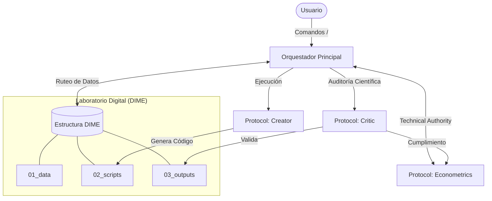

<div align="center">
  
# projectinit-ai

**Framework de Investigación Económica (DIME Standards + Protocol Units)**

[](https://pypi.org/project/projectinit-ai/)
[](https://www.python.org/)
[](https://github.com/MaykolMedrano/projectinit-ai/actions)
[](https://pypi.org/project/projectinit-ai/)
[](https://opensource.org/licenses/MIT)

</div>

> Una **Infraestructura de Investigación** *One-Click Reproducible* que integra los rigurosos estándares metodológicos de **DIME (Banco Mundial)** y el **AEA Data Editor**, potenciada por un ecosistema de **Protocolos de Inteligencia Artificial**.
> Es la evolución oficial del paquete original de Stata [`projectinit`](https://github.com/MaykolMedrano/projectinit).

**Autor**: Maykol Medrano | **GitHub**: [@MaykolMedrano](https://github.com/MaykolMedrano)

Inspirado por el trabajo en educación y reproducibilidad de **Pedro Sant'Anna** y **Scott Cunningham** (Causal Inference: The Mixtape).

---

`projectinit-ai` integra un entorno de investigación con una arquitectura modular basada en protocolos. El sistema automatiza la configuración de estructuras DIME y la aplicación de estándares técnicos en inferencia causal y visualización de datos.

---

## Estructura del Laboratorio Digital

Cuando generas un proyecto desde esta plantilla, obtienes un ecosistema congelado y ruteado:

```text
YourProject/
├── 01_data/               # Datos Crudos, Limpios y Diccionarios (Codebooks)
├── 02_scripts/            # Data Preparation, Analysis, Validation y Master Scripts
│   ├── 00_master.do       # DIME Master Do-file (Stata)
│   ├── 00_master.py       # DIME Master Script (Python)
│   └── utilities/         # Gemini Lit Extractor y utilitarios
├── 03_outputs/            # Tablas LaTeX, Figuras y Logs originales
├── 04_literature/         # Papers descargados y Notas autogeneradas con IA
├── 05_doc/                # Manuscrito y presentaciones
├── 06_admin/              # Ética (IRB), Registro AEA (PAP) y Acuerdos de Mantenimiento
├── .agents/               # "El Cerebro": Checklists Causal/Code y Workflows de IA
├── CLAUDE.md              # Sistema Operativo y "Custom Instructions" base
└── requirements.txt       # "Freezing" del Ambiente y dependencias en Python
```

---

## Arquitectura del Sistema

El siguiente diagrama ilustra cómo interactúan las Unidades de Protocolo con la estructura de archivos DIME y el flujo de trabajo:



---

## El Ecosistema de Protocolos (.agents/)

El verdadero poder de esta plantilla radica en su carpeta oculta `.agents/`. A través del archivo `CLAUDE.md`, cualquier IDE moderno (Cursor, VS Code) absorberá las **"Protocol Units"** de la Economía Cuantitativa.

Tu laboratorio incluye **Unidades de Protocolo Autónomas**:

1. **Protocol: Econometrics (Technical Authority):** Posee el ADN de las Top 5 journals. Enforcea el "AER-Look" (no vertical lines, siunitx fix, clustered stars).
2. **Protocol: Creator (Execution Unit):** Experto en Python/Stata enfocado en código limpio y reproducible.
3. **Protocol: Critic (Causal Identification):** Auditor adversarial de diseños empíricos (SUTVA, Pre-trends, Low Power).
4. **Protocol: Verifier (Quality Gate):** El último paso antes del cierre, califica la estética y el rigor técnico.

---

## Estándares de Visualización y Reporte

El framework incluye una galería de templates diseñados para cumplir con especificaciones técnicas de publicación:

### Gráficos y Visualización

Basados en criterios de proporcionalidad técnica (Líneas 1.1, Ejes 0.6):

- **Event Studies & Parallel Trends**
- **Synthetic Control Method (SCM)**
- **Regression Discontinuity (RDD/RKD)**
- **Density Comparisons & IV Dashboards**

### Estructuras de Tablas

Configuradas para alineación numérica mediante `siunitx`:

- **Paper Pillar:** Layout de alta densidad para múltiples outcomes.
- **Saturated DDD:** Especificaciones de triple diferencia.
- **Heterogeneity Matrix:** Análisis de canales y subgrupos.
- **Advanced summary stats:** Reporte de momentos estadísticos.

> Todos los templates están disponibles en `gallery/` para referenciar como "Gold Standard" durante la escritura del paper.

---

## Infraestructura Científica de Grado de Publicación

`projectinit-ai` provee los componentes finales para la sumisión y réplica:

- **Master Manuscript (manuscript.tex):** Un andamiaje LaTeX completo en `05_doc/` que integra automáticamente el estilo `projectinit_aer.sty` y la configuración `siunitx` profesional.
- **Protocolo de Réplica (REPD.md):** Guía de empaquetado final basada en los estándares del **AEA Data Editor**. Asegura que el proyecto sea reproducible por terceros desde el primer día.
- **Estilo Centralizado (projectinit_aer.sty):** Encapsula el ADN visual de la AER/NBER, permitiendo que tus tablas `.tex` sean limpias y modulares.

**¿Cómo usarlos?** Solo abre el chat de tu IA y escribe los Workflows globales:

- **Protocolo: Contractor Mode (`/contractor-mode`):** Activa el ciclo adversario entre las unidades Critic y Creator hasta alcanzar la perfección técnica.
- **Análisis Pre-Flight (`/data-analysis`):** Obliga a la exploración rigurosa de datos antes de proponer modelos de estimación.
- **Scientific Humanizer (`/humanizer`):** Pule el tono académico de tus borradores y notas de lectura.

---

## Reproducibilidad Nativa (Master Pipeline)

Este repositorio abandona los cuadernos desordenados (Jupyter/Do's aislados).

### Para usuarios de Python: 02_scripts/00_master.py

Se te genera un Pipeline de Ejecución Grado-Corporativo que:

- Fija semillas globales `np.random.seed()` y de Python Built-in.
- Determina rutas automáticas agnósticas a tu computadora usando `pathlib`.
- Captura toda la consola local y documenta una bitácora en `03_outputs/logs/master_{timestamp}.log`.
- Ejecuta los scripts con `subprocess` deteniendo la cola si algún modelo de Análisis o Preparación falla.

### Para usuarios de Stata: 02_scripts/00_master.do

Incluye el clásico andamiaje NBER:

- `adopath ++` para aislar tu ambiente de librerías en Stata.
- Instalador silencioso de dependencias en `02_scripts/utilities/stata_packages.do`.
- Ejecución limpia y lineal asegurando `set seed`.

---

## Gemini Auto-Literature Extractor (v2.5)

El repositorio incluye una herramienta en `02_scripts/utilities/gemini_lit_extractor.py` para procesar documentos PDF y generar resúmenes técnicos en `04_literature/reading_notes`.

### Instrucciones de uso

1. Obtén tu llave y ejecútalo en consola:

   ```bash
   set GOOGLE_API_KEY=tu_clave_aca
   ```

2. Deposita PDFs en `04_literature/papers/`.
3. Ejecuta:

   ```bash
   python 02_scripts/utilities/gemini_lit_extractor.py --api-key TU_CLAVE_AQUI
   ```

   *(Opcional: Si ya tienes exportada la variable `GOOGLE_API_KEY`, simplemente ejecuta `python 02_scripts/utilities/gemini_lit_extractor.py`)*

4. Revisiones de literatura (Pregunta Central, Datos, Métodos, Fallas Causales) aparecerán auto-escritas en formato Markdown.

---

## Cómo Empezar

**Paso 1: Instalación del paquete (Vía PIP)**

Abre tu terminal y ejecuta:

```bash
pip install projectinit-ai
```

**Paso 2: Genera tu Laboratorio Inicial**

Navega a la carpeta donde quieras crear tu investigación y ejecuta:

```bash
projectinit-ai nombre_de_tu_proyecto
```

*(Esto creará la carpeta con la estructura DIME y los Agentes instantáneamente).*

**Paso 3: Desarrolla tu Paper e Inicializa los Agentes**

Entra a la carpeta (`cd nombre_de_tu_proyecto`), instala las dependencias locales (`pip install -r requirements.txt`) y abre tu Editor (Cursor / VS Code). El `CLAUDE.md` levantará a los Agentes de inmediato.
Usa tu chat para pedir modelos y deja que el `/contractor-mode` audite tu econometría y guarde tus tablas impecables en `03_outputs`.

---

## Integración con Agentes de IA

El framework está diseñado para ser "AI-Native", permitiendo que diferentes herramientas de asistencia técnica absorban el conocimiento del proyecto:

### Configuración por Herramienta

- **Cursor / Windsurf:** Estos IDEs leen automáticamente el archivo `CLAUDE.md` en la raíz del proyecto. Al abrir la carpeta, el agente asumirá los principios de DIME y los protocolos de visualización definidos.
- **Claude Desktop / Cline / Roo Code:** Se recomienda indexar la carpeta `.agents/` para que el asistente tenga acceso a los checklists y workflows de validación econométrica.
- **Antigravity / Custom Agents:** El archivo `CLAUDE.md` sirve como la "Constitución" del proyecto, definiendo las reglas de escritura de código y reporte de resultados.

### El rol de CLAUDE.md y .agents/

- **CLAUDE.md:** Centraliza las reglas de estilo de código, la estructura de carpetas y los comandos disponibles.
- **Directorio .agents/:** Contiene los protocolos específicos (Econometría, Creador, Crítico) y checklists que el agente debe consultar antes de finalizar cualquier tarea.

---

## Filosofía y Reconocimientos

Esta **Infraestructura** es la culminación de buenas prácticas recopiladas de:

- **DIME (World Bank)** — Arquitectura de Archivos Global.
- **AEA Data Editor** — Estándares de Transparencia del Código.
- **J-PAL (MIT)** — Integridad de Datos e Investigación Limpia.

## Licencia

Este repositorio está distribuido libremente bajo la licencia [MIT](LICENSE).
