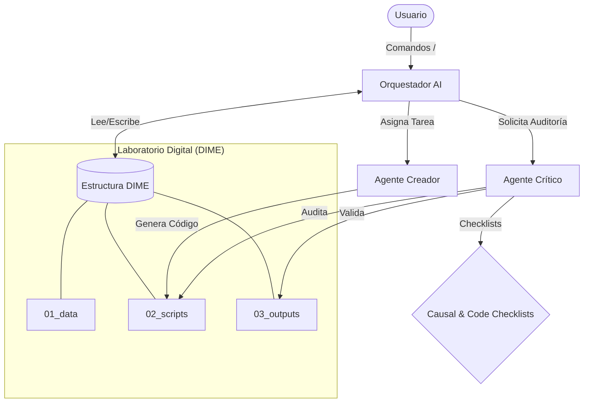

<div align="center">
  
# projectinit-ai
  
**The Next-Gen Economics Research Boilerplate (DIME Standards + AI Agents)**

[](https://www.python.org/)
[](https://www.stata.com/)
[](https://ai.google.dev/)
[](https://github.com/MaykolMedrano/projectinit-ai/stargazers)
[](https://opensource.org/licenses/MIT)

</div>

> Un andamiaje de investigación *One-Click Reproducible* que integra los rigurosos estándares metodológicos de **DIME (Banco Mundial)** y el **AEA Data Editor**, potenciado por un enjambre algorítmico local de **Agentes de Inteligencia Artificial**.
> Es la evolución oficial del paquete original de Stata [`projectinit`](https://github.com/MaykolMedrano/projectinit).

**Autor**: Maykol Medrano | **GitHub**: [@MaykolMedrano](https://github.com/MaykolMedrano)

Inspirado por el trabajo en educación y reproducibilidad de **Pedro Sant'Anna** y **Scott Cunningham** (Causal Inference: The Mixtape).

---

## ¿Por qué Projectinit-AI?

La investigación empírica moderna exige dos cosas que suelen competir entre sí: **Velocidad** (para implementar modelos complejos rápidamente) y **Rigor Absoluto** (para publicar en Top Journals cumpliendo estándares J-PAL/AEA).

`projectinit-ai` resuelve este dilema al inyectar tu repositorio vacío con un equipo de Inteligencia Artificial ("El Cerebro") y una arquitectura lista para la producción. No tienes que entrenar a la IA sobre qué es un Instrumental Variable o cómo estructurar carpetas; ya viene programado.

---

## Estructura del Laboratorio Digital

Cuando generas un proyecto desde esta plantilla, obtienes un ecosistema congelado y ruteado:

```text
YourProject/
├── 01_data/               # Datos Crudos, Limpios y Diccionarios (Codebooks)
├── 02_scripts/            # Data Preparation, Analysis, Validation y Master Scripts
│   ├── 00_master.do       # DIME Master Do-file (Stata)
│   ├── 00_master.py       # DIME Master Script (Python)
│   └── ados/              # Gemini Lit Extractor y utilitarios
├── 03_outputs/            # Tablas LaTeX, Figuras y Logs originales
├── 04_literature/         # Papers descargados y Notas autogeneradas con IA
├── 05_doc/                # Manuscrito y presentaciones
├── 06_admin/              # Ética (IRB), Registro AEA (PAP) y Acuerdos de Mantenimiento
├── .agents/               # "El Cerebro": Checklists Causal/Code y Workflows de IA
├── CLAUDE.md              # Sistema Operativo y "Custom Instructions" base
└── requirements.txt       # "Freezing" del Ambiente y dependencias en Python
```

---

## Arquitectura del Sistema

El siguiente diagrama ilustra cómo interactúan los Agentes de IA con la estructura de archivos DIME y tu flujo de trabajo:



---

## El Ecosistema Multi-Agente (.agents/)

El verdadero poder de esta plantilla radica en su carpeta oculta `.agents/`. A través del archivo `CLAUDE.md`, cualquier IDE moderno (Cursor, VS Code + Cline, Windsurf) absorberá las "Reglas de Dominio" de la Economía Cuantitativa.

### Ciclo Adversarial (Contractor Mode)

Para garantizar que el código no solo corra, sino que sea metodológicamente sólido, implementamos un loop de "Abogado del Diablo":


Tu laboratorio incluye **Perfiles de Agentes Autónomos**:

1. **El Orquestador:** Administra la memoria del proyecto, divide tareas complejas (Tesis o Papers) y llama a otros agentes.
2. **Revisor de Dominio (Crítico Causal):** Especialista en Inferencia Causal (Angrist/Pischke). Antes de que corras una regresión, este agente audita tu diseño metodológico contra sus `checklists` internos (Matching, IV, SCM, RDD).
3. **El Creador:** Experto en Python y Stata, enfocado en generar código limpio que cumpla con los lineamientos de Gentzkow & Shapiro.
4. **Verificador de Calidad:** Audita las salidas (Output Files) buscando P-hacking encubierto, errores de estandarización o gráficas mal formateadas.

**¿Cómo usarlos?** Solo abre el chat de tu IA y escribe los Workflows globales:

- `/contractor-mode`: Desata un loop contencioso donde El Creador y El Crítico debaten tu código hasta que es inquebrantable.
- `/data-analysis`: Obliga a la IA a hacer análisis exploratorio real (estadísticas de resumen) antes de proponer modelos.
- `/qa-quarto`: Pule tus .tex y .md académicamente.

---

## Reproducibilidad Nativa (Master Pipeline)

Este repositorio abandona los cuadernos desordenados (Jupyter/Do's aislados).

### Para usuarios de Python: 02_scripts/00_master.py

Se te genera un Pipeline de Ejecución Grado-Corporativo que:

- Fija semillas globales `np.random.seed()` y de Python Built-in.
- Determina rutas automáticas agnósticas a tu computadora usando `pathlib`.
- Captura toda la consola local y documenta una bitácora en `03_outputs/logs/master_{timestamp}.log`.
- Ejecuta los scripts con `subprocess` deteniendo la cola si algún modelo de Análisis o Preparación falla.

### Para usuarios de Stata: 02_scripts/00_master.do

Incluye el clásico andamiaje NBER:

- `adopath ++` para aislar tu ambiente de librerías en Stata.
- Instalador silencioso de dependencias en `02_scripts/ados/stata_packages.do`.
- Ejecución limpia y lineal asegurando `set seed`.

---

## Gemini Auto-Literature Extractor (v2.5)

¿Cansado de leer decenas de PDFs antes de tu Review of Literature?

El repositorio incluye un script especializado en `02_scripts/ados/gemini_lit_extractor.py`. Utilizando la ventana de contexto de **Gemini 2.5 Flash**, este script inyectará cientos de páginas de un PDF en milisegundos y devolverá un resumen metodológico en la carpeta `04_literature/reading_notes`.

### Instrucciones de uso

1. Obtén tu llave y ejecútalo en consola:

   ```bash
   set GOOGLE_API_KEY=tu_clave_aca
   ```

2. Deposita PDFs en `04_literature/papers/`.
3. Ejecuta:

   ```bash
   python 02_scripts/ados/gemini_lit_extractor.py
   ```

4. Revisiones de literatura (Pregunta Central, Datos, Métodos, Fallas Causales) aparecerán auto-escritas en formato Markdown.

---

## Cómo Empezar

**Paso 1: Clonar e Iniciar tu Investigación**

1. Haz clic en el botón verde **Use this template** (arriba a la derecha en GitHub) > **Create a new repository**.
2. Ponle nombre a tu proyecto (ej: `tesis-polucion`) y clónalo a tu computadora.
3. Abre la carpeta recién clonada en tu Editor (Cursor / VS Code). El `CLAUDE.md` levantará a los Agentes de inmediato.

**Paso 2: Desarrolla tu Paper**
Usa tu chat para pedir modelos y deja que el `/contractor-mode` audite tu econometría y guarde tus tablas impecables en `03_outputs`.

---

## Filosofía y Reconocimientos

Este andamiaje es la culminación de buenas prácticas recopiladas de:

- **DIME (World Bank)** — Arquitectura de Archivos Global.
- **AEA Data Editor** — Estándares de Transparencia del Código.
- **J-PAL (MIT)** — Integridad de Datos e Investigación Limpia.

## Licencia

Este repositorio está distribuido libremente bajo la licencia [MIT](LICENSE).
